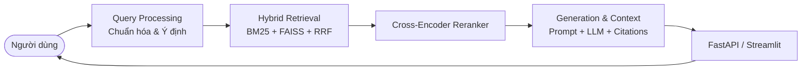

# 🎓 University QA - Hệ Thống Hỏi Đáp Đào Tạo & Tuyển Sinh (RAG)

Hệ thống Hỏi - Đáp thông minh dành cho trường đại học ứng dụng kỹ thuật **RAG (Retrieval-Augmented Generation)** tiên tiến, kết hợp tìm kiếm lai (**Hybrid Search: BM25 + Vector FAISS**), bộ tái xếp hạng (**Cross-Encoder Reranker**), bộ điều khiển intent và mô hình sinh ngôn ngữ lớn (LLM) chống ảo giác với trích dẫn minh bạch.

Dự án được quản lý gói và môi trường bằng **[uv](https://github.com/astral-sh/uv)** - công cụ Python cực nhanh và hiện đại.

---

## 🏗️ Kiến Trúc Hệ Thống



1. **Data Layer (`src/university_qa/data/`)**: Trích xuất, chuẩn hóa, phân đoạn ngữ nghĩa (chunking có overlap), sinh metadata cohort và parser bảng biểu dữ liệu cấu trúc (học phí, tín chỉ).
2. **Retrieval Layer (`src/university_qa/retrieval/`)**: Kết hợp Dense Retrieval (mE5 / BGE-M3 + FAISS) và Sparse Retrieval (BM25 tiếng Việt), hợp nhất thứ hạng bằng **Reciprocal Rank Fusion (RRF)**.
3. **Reranking Layer (`src/university_qa/reranking/`)**: Lọc sâu và tái chấm điểm bằng mô hình Cross-Encoder (`bge-reranker-large` / `v2-m3`).
4. **Query & Intent Layer (`src/university_qa/query/`)**: Phân loại ý định (Factoid, Tra cứu bảng, Ngoài miền OOD), chuẩn hóa từ viết tắt và viết lại câu hỏi đa lượt.
5. **Generation Layer (`src/university_qa/generation/`)**: Ghép context tối ưu, prompt kỹ nghệ nghiêm ngặt chống bịa đặt (hallucination), trích dẫn citation chính xác nguồn văn bản.
6. **Scientific Evaluation (`src/university_qa/evaluation/`)**: Đánh giá đa chiều với Hit@K, MRR, NDCG, Faithfulness và tỷ lệ từ chối câu hỏi OOD.

---

## ⚡ Cài Đặt và Khởi Chạy với `uv`

### 1. Yêu cầu tiên quyết
- Đã cài đặt `uv` (Xem hướng dẫn: `curl -LsSf https://astral.sh/uv/install.sh | sh` hoặc trên Windows: `winget install --id=astral-sh.uv`).
- Python >= 3.10

### 2. Cài đặt môi trường ảo và dependencies
```bash
cd university-qa

# Khởi tạo môi trường ảo với uv
uv venv

# Cài đặt toàn bộ dependencies theo pyproject.toml
uv sync
```

### 3. Cấu hình biến môi trường
Tạo file `.env` từ file mẫu `.env.example`:
```bash
cp .env.example .env
# Chỉnh sửa API key OpenAI hoặc Gemini trong .env
```

### 4. Chuẩn bị dữ liệu và lập chỉ mục
```bash
# Xử lý dữ liệu thô sang corpus sạch
uv run python scripts/ingest_data.py

# Xây dựng chỉ mục BM25 và FAISS
uv run python scripts/build_bm25.py
uv run python scripts/build_faiss.py
```

### 5. Chạy Backend API (FastAPI)
```bash
uv run uvicorn api.main:app --host 0.0.0.0 --port 8000 --reload
# API Docs Swagger: http://localhost:8000/docs
```

### 6. Chạy Frontend Giao Diện (Streamlit)
```bash
uv run streamlit run frontend/app.py
```

### 7. Chạy kiểm thử tự động (Tests)
```bash
uv run pytest tests/
```

### 8. Đánh giá thực nghiệm (Evaluation)
```bash
uv run python scripts/evaluate.py
```

---

## 📂 Cấu Trúc Dự Án

```
university-qa/
├── configs/                  # File cấu hình YAML (base, dev, eval, prod)
├── data/                     # Dữ liệu raw, interim, processed, evaluation
├── src/university_qa/        # Source code chính gồm 8 modules RAG
│   ├── data/                 # TV1: ETL & Chunking & Structured parser
│   ├── retrieval/            # TV2: BM25, FAISS, Embedding, RRF
│   ├── reranking/            # TV2: Cross-Encoder Reranker
│   ├── query/                # TV3: Normalizer, Rewriting, Intent classifier
│   ├── generation/           # TV3: LLM API, Prompts, Citations
│   ├── pipeline/             # TV2+TV3: RAG pipeline & Conversational flow
│   ├── evaluation/           # Cả nhóm: Benchmark & Scientific metrics
│   └── utils/                # Tiện ích logger JSONL, config loader, I/O
├── api/                      # Backend FastAPI (/api/v1/query, /healthz)
├── frontend/                 # Giao diện người dùng Streamlit
├── scripts/                  # Scripts build index, ETL, chạy pipeline, eval
├── tests/                    # Unit tests và integration tests với Pytest
├── notebooks/                # Jupyter notebooks nghiên cứu thực nghiệm
├── experiments/              # Kết quả đo lường đối sánh (baseline, hybrid, rerank)
└── docs/                     # Tài liệu kỹ thuật contracts & specifications
```

---

## 👥 Phân Công Trách Nhiệm
- **TV1**: Tiền xử lý dữ liệu, trích xuất cấu trúc văn bản quy chế, chunking theo ngữ nghĩa, xây dựng metadata và bộ phân tích bảng học phí.
- **TV2**: Thiết kế bộ tìm kiếm lai Hybrid Search (BM25 + Vector FAISS), thuật toán RRF và tích hợp mô hình Reranker.
- **TV3**: Xử lý truy vấn, phân loại ý định, kết nối LLM sinh câu trả lời, thiết kế prompt chống ảo giác, xây dựng REST API và Web UI.
- **Cả nhóm**: Thiết kế bộ dữ liệu benchmark, đo đạc chỉ số (MRR, NDCG, Faithfulness) và viết báo cáo khoa học.

---

## 📜 Giấy Phép
Dự án được cấp phép theo giấy phép [MIT](LICENSE).
