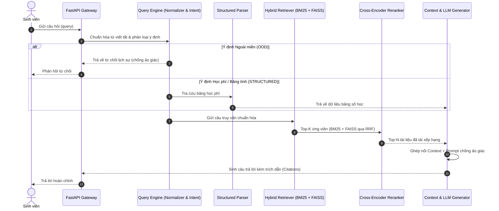

# 🏛️ Tài Liệu Kiến Trúc Hệ Thống (Architecture Design)

## 1. Tổng quan hệ thống
Hệ thống **University QA** là kiến trúc RAG chuyên biệt cho các trường đại học, phục vụ việc tra cứu quy chế đào tạo, chuẩn đầu ra, học bổng và biểu phí.

## 2. Sơ đồ dòng dữ liệu và xử lý (End-to-End Flow)

## 3. Các phân hệ chính
1. **Module Tiền xử lý (TV1)**: Đọc file thô, làm sạch ký tự lạ tiếng Việt, phân đoạn theo Điều/Khoản quy chế, gán metadata cohort.
2. **Module Tìm kiếm & Tái xếp hạng (TV2)**: Kết hợp BM25 (từ khóa tiếng Việt) + FAISS (ngữ nghĩa đa ngôn ngữ E5/BGE) + Reciprocal Rank Fusion + BGE Reranker.
3. **Module Xử lý truy vấn & Sinh ngôn ngữ (TV3)**: Mở rộng từ viết tắt học vụ, phân loại intent, prompt chống bịa đặt, gọi Gemini/OpenAI API và trích dẫn chuẩn hóa.
